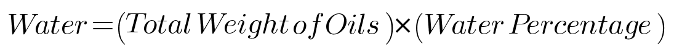
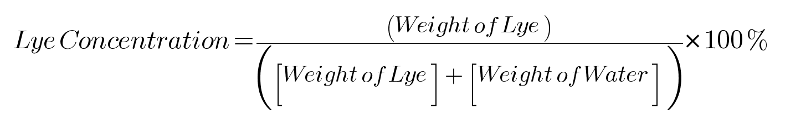
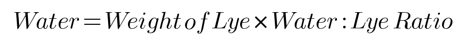

# Open Soap Calculator

## Goals

An open source application that can be ported, used and added anywhere for free by anyone. 

This application is meant to be used to calculate soap qualities and characteristic as well as lye usage needed per soap formulation

## Information Banks

### Lye Types
- NaOH (Sodium Hydroxide): Produces hard, solid soap.
- KOH (Potassium Hydroxide): Produces soft, liquid, or gel-like soap.

### Water

Water can be calculated in three different ways:

#### 1. Water as % of Oils
This method calculates water based on a percentage of the total weight of oils used in the soap recipe.

**Formula**:

Water = (Total Weight of Oils) x (Water Percentage)

**Common Percentages**:
- Typically ranges from 25% to 38%
- A common default is 38%

#### 2. Lye Concentration
This method focuses on the concentration of lye in the total water and lye solution.

**Formula**:

Lye Concentration = { [Weight of Lye]/([Weight of Lye] + [Weight of Water]) } x 100% 

**Common Concentrations**:
- Typically ranges from 25% to 50%
- A common starting point is 33%

### 3. Water : Lye Ratio
This method uses a simple ratio to determine the amount of water relative to the amount of lye.

**Formula**:

Water = (Weight of Lye) x (Water : Lye Ratio)

**Common Ratios**:
- Typically ranges from 1:1 to 3:1
- A common starting point is 2:1

